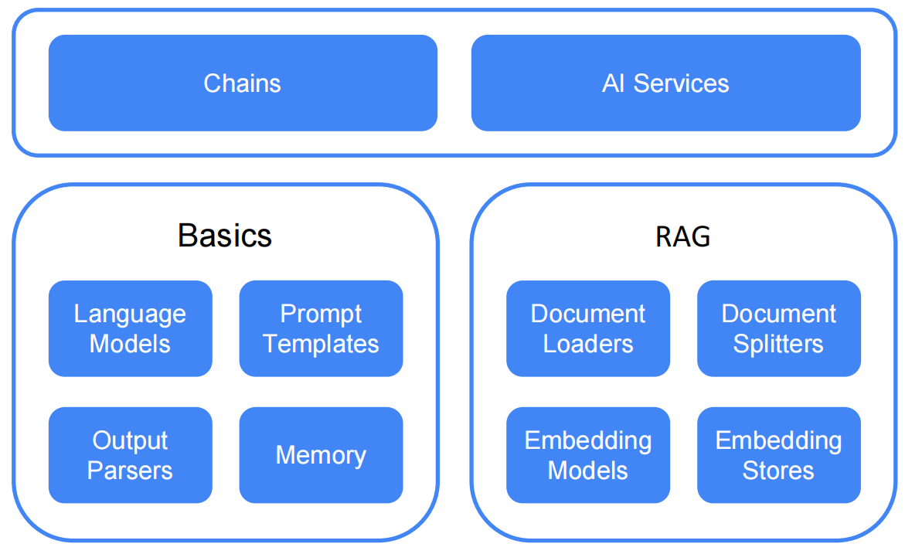
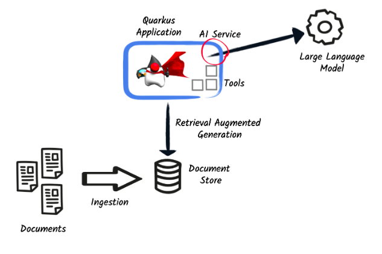

# langchain4j-examples

O objetivo desse repositório é o estudo do framework LangChain4j, colocando em prática suas principais funcionalidades com Quarkus.

O projeto contém a própria biblioteca LangChain4j do Quarkus, assim como o quarkus-rest-jsonb, quarkus-hibernate-orm-panache, quarkus-jdbc-postgresql e quarkus-smallrye-openapi para documentação Swagger, que pode ser acessada em http://localhost:8080/q/swagger-ui/.

## LangChain4j
É uma biblioteca cujo objetivo é simplificar a integração de LLMs em aplicativos Java.
Ele unifica as funcionalidades das APIS dos provedores de LLM, tirando a necessidade de reescrever código para cada um deles.

A biblioteca começou seu desenvolvimento no início de 2023. O LangChain4j é uma fusão de ideias e conceitos do LangChain, Haystack, LlamaIndex e da comunidade em geral.

### Níveis de abstração
1. **Nível Baixo:** Oferece acesso direto a componentes como `ChatLanguageModel`, `UserMessage`, `AiMessage`, e `EmbeddingStore`. Ideal para controle total e personalização profunda, mas exige mais código e esforço.
2. **Nível Alto:** Fornece APIs de alto nível, como `AI Services`, que abstraem a complexidade e facilitam o uso. Permite ajustes declarativos com menos esforço.


### Estrutura da biblioteca
Apresenta um desing modular, compreendendo os módulos:
 - langchain4j-core: define as abstrações principais (como `ChatLanguageModel`e `EmbeddingStore`) e suas APIs.
 - módulo principal langchain4j, contendo ferramentas úteis como carregamento de documentos, implementações de chat memory e características de alto nível como AI Services.
 - Uma vasta lista de módulos de integrações com LLMS (langchain4j-{integration})

### Casos de uso
- Criar chatbots que acessam seus dados e se comportam como você definir
	- Customer support chatbot
	- Educational assistant
- Processar muitos dados desestruturados e extrair informação estruturada dos mesmos
- Gerar informação 
	- Emails
	- Blog posts
- Sumarizar, reescrever, traduzir informação.

Entre muitos outros!

## Quarkus LangChain4j

A extensão LangChain4j do quarkus oferece uma maneira declarativa para interagir com diversas *LLMs*. Isso facilita funções invocadas por *LLMs* com aplicações Quarkus e permite carregamento de documentos com o *LLM context*.



### Configurando 
Para incomporar a extensão ao projeto Quarkus, adicione a depêndencia:

```
<dependency>
    <groupId>io.quarkiverse.langchain4j</groupId>
    <artifactId>quarkus-langchain4j-openai</artifactId>
    <version>0.22.0</version>
</dependency>
```

E inclua sua API Key do LLM escolhido no arquivo application.properties:

```
quarkus.langchain4j.openai.api-key=sk-...
```


## Referências: 

[Documentação LangChain4j](https://docs.langchain4j.dev/intro)

[Documentação Quarkiverse da extensão LangChain4j](https://docs.quarkiverse.io/quarkus-langchain4j/dev/index.html)